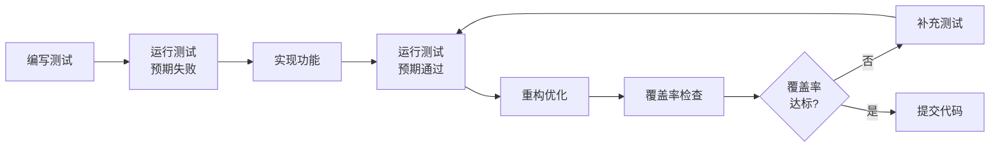

# VSCode 扩展自动化测试与修复指南

## 概述

本指南介绍如何使用 VSCode 扩展自动对 YL-Monitor 项目进行覆盖率测试和修复。

---

## 一、推荐的 VSCode 扩展

### 1. 测试相关扩展

| 扩展名称 | 功能 | 安装命令 |
|---------|------|---------|
| **Python Test Explorer** | 可视化测试管理 | 在扩展商店搜索 "Python Test Explorer" |
| **Coverage Gutters** | 实时覆盖率显示 | 在扩展商店搜索 "Coverage Gutters" |
| **Python** (Microsoft) | Python 语言支持 | 已内置 |
| **Pylance** | 类型检查和智能提示 | 已内置 |

### 2. 代码质量扩展

| 扩展名称 | 功能 | 安装命令 |
|---------|------|---------|
| **Ruff** | 快速 Python 代码检查 | `pip install ruff` |
| **Black Formatter** | 代码格式化 | `pip install black` |
| **mypy** | 静态类型检查 | `pip install mypy` |
| **Bandit** | 安全漏洞检查 | `pip install bandit` |

---

## 二、配置 VSCode 测试环境

### 1. 创建 VSCode 配置文件

在项目根目录创建 `.vscode/settings.json`：

```json
{
    "python.testing.pytestArgs": [
        "tests",
        "-v",
        "--cov=app",
        "--cov-report=html:htmlcov",
        "--cov-report=xml:coverage.xml",
        "--cov-report=term-missing"
    ],
    "python.testing.unittestEnabled": false,
    "python.testing.pytestEnabled": true,
    "python.testing.autoTestDiscoverOnSaveEnabled": true,
    
    "coverage-gutters.showLineCoverage": true,
    "coverage-gutters.showRulerCoverage": true,
    "coverage-gutters.coverageBaseDir": "htmlcov",
    "coverage-gutters.coverageFileNames": [
        "coverage.xml",
        "htmlcov/coverage.xml"
    ],
    
    "python.linting.enabled": true,
    "python.linting.ruffEnabled": true,
    "python.linting.mypyEnabled": true,
    "python.formatting.provider": "black",
    "editor.formatOnSave": true,
    "editor.codeActionsOnSave": {
        "source.organizeImports": true,
        "source.fixAll": true
    }
}
```

### 2. 创建测试任务配置

创建 `.vscode/tasks.json`：

```json
{
    "version": "2.0.0",
    "tasks": [
        {
            "label": "Run All Tests",
            "type": "shell",
            "command": "${command:python.executeInTerminal}",
            "args": [
                "-m", "pytest", "tests", "-v", "--cov=app", "--cov-report=html"
            ],
            "group": {
                "kind": "test",
                "isDefault": true
            },
            "presentation": {
                "echo": true,
                "reveal": "always",
                "focus": false,
                "panel": "shared"
            },
            "problemMatcher": []
        },
        {
            "label": "Run Tests with Coverage",
            "type": "shell",
            "command": "python",
            "args": [
                "-m", "pytest", "tests", 
                "-v", 
                "--cov=app", 
                "--cov-report=html:htmlcov",
                "--cov-report=xml:coverage.xml",
                "--cov-report=term-missing"
            ],
            "group": "test",
            "presentation": {
                "echo": true,
                "reveal": "always",
                "focus": false,
                "panel": "shared"
            }
        },
        {
            "label": "Auto Fix Import Errors",
            "type": "shell",
            "command": "python",
            "args": [
                "scripts/auto_fix_imports.py"
            ],
            "group": "build",
            "presentation": {
                "echo": true,
                "reveal": "always",
                "focus": false,
                "panel": "shared"
            }
        },
        {
            "label": "Code Quality Check",
            "type": "shell",
            "command": "python",
            "args": [
                "-m", "ruff", "check", "app", "tests"
            ],
            "group": "build",
            "presentation": {
                "echo": true,
                "reveal": "always",
                "focus": false,
                "panel": "shared"
            }
        }
    ]
}
```

### 3. 创建快捷键绑定

创建 `.vscode/keybindings.json`：

```json
[
    {
        "key": "ctrl+shift+t",
        "command": "workbench.action.tasks.runTask",
        "args": "Run All Tests"
    },
    {
        "key": "ctrl+shift+c",
        "command": "workbench.action.tasks.runTask",
        "args": "Run Tests with Coverage"
    },
    {
        "key": "ctrl+shift+f",
        "command": "workbench.action.tasks.runTask",
        "args": "Auto Fix Import Errors"
    },
    {
        "key": "ctrl+shift+q",
        "command": "workbench.action.tasks.runTask",
        "args": "Code Quality Check"
    }
]
```

---

## 三、自动化修复脚本

### 1. 创建自动修复导入错误脚本

创建 `scripts/auto_fix_imports.py`：

```python
#!/usr/bin/env python3
"""
自动修复导入错误脚本

功能：
1. 扫描所有测试文件中的导入语句
2. 检测缺失的类/函数
3. 自动在源文件中添加缺失的定义
"""

import ast
import os
import re
from pathlib import Path
from typing import Set, Dict, List, Tuple


class ImportErrorFixer:
    """自动修复导入错误"""
    
    def __init__(self, project_root: str):
        self.project_root = Path(project_root)
        self.test_dir = self.project_root / "tests"
        self.app_dir = self.project_root / "app"
        self.errors_found: List[Tuple[str, str, str]] = []  # (test_file, import_name, source_file)
    
    def scan_test_files(self) -> None:
        """扫描测试文件中的导入"""
        for test_file in self.test_dir.rglob("*.py"):
            if test_file.name.startswith("__"):
                continue
            
            print(f"扫描测试文件: {test_file}")
            self._analyze_test_file(test_file)
    
    def _analyze_test_file(self, test_file: Path) -> None:
        """分析单个测试文件"""
        try:
            with open(test_file, 'r', encoding='utf-8') as f:
                content = f.read()
            
            # 解析 AST
            tree = ast.parse(content)
            
            for node in ast.walk(tree):
                if isinstance(node, ast.ImportFrom):
                    module = node.module
                    if module and module.startswith('app.'):
                        for alias in node.names:
                            name = alias.name
                            self._check_import_exists(module, name, str(test_file))
        
        except Exception as e:
            print(f"  解析失败: {e}")
    
    def _check_import_exists(self, module: str, name: str, test_file: str) -> None:
        """检查导入是否存在于源文件中"""
        # 转换模块路径为文件路径
        module_parts = module.split('.')
        source_file = self.app_dir / Path(*module_parts[1:]).with_suffix('.py')
        
        if not source_file.exists():
            print(f"  ⚠️ 源文件不存在: {source_file}")
            return
        
        # 检查类/函数是否存在于源文件
        try:
            with open(source_file, 'r', encoding='utf-8') as f:
                source_content = f.read()
            
            # 简单的文本检查（实际应该使用 AST）
            patterns = [
                rf"class\s+{name}\b",
                rf"def\s+{name}\b",
                rf"{name}\s*=\s*",  # 变量赋值
            ]
            
            found = any(re.search(p, source_content) for p in patterns)
            
            if not found:
                print(f"  ❌ 缺失: {module}.{name}")
                self.errors_found.append((test_file, name, str(source_file)))
            else:
                print(f"  ✅ 存在: {module}.{name}")
                
        except Exception as e:
            print(f"  检查失败: {e}")
    
    def generate_fixes(self) -> None:
        """生成修复方案"""
        print("\n" + "="*60)
        print("生成修复方案")
        print("="*60)
        
        fixes_by_file: Dict[str, List[str]] = {}
        
        for test_file, name, source_file in self.errors_found:
            if source_file not in fixes_by_file:
                fixes_by_file[source_file] = []
            fixes_by_file[source_file].append(name)
        
        for source_file, names in fixes_by_file.items():
            print(f"\n文件: {source_file}")
            print(f"需要添加: {', '.join(names)}")
            
            # 生成建议的代码
            self._suggest_fix(source_file, names)
    
    def _suggest_fix(self, source_file: str, names: List[str]) -> None:
        """为缺失的名称生成建议的修复代码"""
        print("建议添加的代码:")
        print("-" * 40)
        
        for name in names:
            # 根据命名约定猜测类型
            if name.endswith('Type') or name.endswith('Status') or name.endswith('Level'):
                # 可能是枚举
                print(f"""
# TODO: 添加 {name} 枚举
class {name}(Enum):
    \"\"\"【{name}】描述\"\"\"
    VALUE1 = auto()
    VALUE2 = auto()
""")
            elif name.startswith('get_') or name.startswith('create_'):
                # 可能是函数
                print(f"""
# TODO: 添加 {name} 函数
def {name}():
    \"\"\"【{name}】描述\"\"\"
    pass
""")
            else:
                # 可能是类
                print(f"""
# TODO: 添加 {name} 类
class {name}:
    \"\"\"【{name}】描述\"\"\"
    pass
""")
        
        print("-" * 40)
    
    def apply_fixes(self) -> None:
        """自动应用修复（谨慎使用）"""
        print("\n" + "="*60)
        print("自动应用修复")
        print("="*60)
        
        fixes_by_file: Dict[str, List[str]] = {}
        
        for test_file, name, source_file in self.errors_found:
            if source_file not in fixes_by_file:
                fixes_by_file[source_file] = []
            fixes_by_file[source_file].append(name)
        
        for source_file, names in fixes_by_file.items():
            self._apply_fix_to_file(source_file, names)
    
    def _apply_fix_to_file(self, source_file: str, names: List[str]) -> None:
        """应用修复到单个文件"""
        try:
            with open(source_file, 'r', encoding='utf-8') as f:
                content = f.read()
            
            # 在文件末尾添加缺失的定义
            additions = []
            for name in names:
                if name.endswith('Type') or name.endswith('Status') or name.endswith('Level'):
                    additions.append(f"""

class {name}(Enum):
    \"\"\"【{name}】自动生成的枚举\"\"\"
    VALUE1 = auto()
    VALUE2 = auto()
""")
                elif name.startswith('get_') or name.startswith('create_'):
                    additions.append(f"""

def {name}():
    \"\"\"【{name}】自动生成的函数\"\"\"
    pass
""")
                else:
                    additions.append(f"""

class {name}:
    \"\"\"【{name}】自动生成的类\"\"\"
    pass
""")
            
            # 添加到文件
            new_content = content + '\n'.join(additions)
            
            # 备份原文件
            backup_file = source_file + '.backup'
            with open(backup_file, 'w', encoding='utf-8') as f:
                f.write(content)
            
            # 写入新内容
            with open(source_file, 'w', encoding='utf-8') as f:
                f.write(new_content)
            
            print(f"✅ 已修复: {source_file}")
            print(f"   备份: {backup_file}")
            
        except Exception as e:
            print(f"❌ 修复失败 {source_file}: {e}")


def main():
    """主函数"""
    project_root = Path(__file__).parent.parent
    
    print("="*60)
    print("YL-Monitor 自动导入修复工具")
    print("="*60)
    
    fixer = ImportErrorFixer(str(project_root))
    
    # 扫描测试文件
    print("\n扫描测试文件...")
    fixer.scan_test_files()
    
    # 生成修复方案
    fixer.generate_fixes()
    
    # 询问是否应用修复
    if fixer.errors_found:
        response = input("\n是否自动应用修复? (y/n): ")
        if response.lower() == 'y':
            fixer.apply_fixes()
            print("\n✅ 修复完成！请检查修改后的文件。")
        else:
            print("\n⏹️  跳过自动修复。请手动根据建议添加缺失的定义。")
    else:
        print("\n✅ 未发现导入错误！")


if __name__ == "__main__":
    main()
```

### 2. 创建覆盖率分析脚本

创建 `scripts/analyze_coverage.py`：

```python
#!/usr/bin/env python3
"""
覆盖率分析报告生成器

功能：
1. 运行测试并收集覆盖率数据
2. 生成详细的覆盖率报告
3. 识别未覆盖的代码区域
4. 提供改进建议
"""

import subprocess
import json
import xml.etree.ElementTree as ET
from pathlib import Path
from typing import Dict, List, Tuple


class CoverageAnalyzer:
    """覆盖率分析器"""
    
    def __init__(self, project_root: str):
        self.project_root = Path(project_root)
        self.coverage_xml = self.project_root / "coverage.xml"
        self.report_dir = self.project_root / "htmlcov"
    
    def run_tests_with_coverage(self) -> bool:
        """运行测试并生成覆盖率数据"""
        print("运行测试并收集覆盖率数据...")
        
        cmd = [
            "python", "-m", "pytest",
            "tests",
            "-v",
            "--cov=app",
            "--cov-report=xml:coverage.xml",
            "--cov-report=html:htmlcov",
            "--cov-report=term-missing"
        ]
        
        try:
            result = subprocess.run(
                cmd,
                cwd=self.project_root,
                capture_output=True,
                text=True,
                timeout=300
            )
            
            print(result.stdout)
            if result.stderr:
                print("错误输出:", result.stderr)
            
            return result.returncode == 0
            
        except subprocess.TimeoutExpired:
            print("❌ 测试超时")
            return False
        except Exception as e:
            print(f"❌ 测试运行失败: {e}")
            return False
    
    def parse_coverage_xml(self) -> Dict:
        """解析覆盖率 XML 报告"""
        if not self.coverage_xml.exists():
            print(f"❌ 覆盖率文件不存在: {self.coverage_xml}")
            return {}
        
        try:
            tree = ET.parse(self.coverage_xml)
            root = tree.getroot()
            
            coverage_data = {
                'overall': {
                    'line_rate': float(root.get('line-rate', 0)),
                    'branch_rate': float(root.get('branch-rate', 0)),
                    'lines_valid': int(root.get('lines-valid', 0)),
                    'lines_covered': int(root.get('lines-covered', 0)),
                },
                'packages': []
            }
            
            for package in root.findall('.//package'):
                package_data = {
                    'name': package.get('name'),
                    'line_rate': float(package.get('line-rate', 0)),
                    'classes': []
                }
                
                for cls in package.findall('.//class'):
                    class_data = {
                        'name': cls.get('name'),
                        'filename': cls.get('filename'),
                        'line_rate': float(cls.get('line-rate', 0)),
                        'uncovered_lines': []
                    }
                    
                    # 获取未覆盖的行
                    for line in cls.findall('.//line'):
                        if int(line.get('hits', 0)) == 0:
                            class_data['uncovered_lines'].append(
                                int(line.get('number'))
                            )
                    
                    package_data['classes'].append(class_data)
                
                coverage_data['packages'].append(package_data)
            
            return coverage_data
            
        except Exception as e:
            print(f"❌ 解析覆盖率文件失败: {e}")
            return {}
    
    def generate_report(self, coverage_data: Dict) -> None:
        """生成覆盖率分析报告"""
        if not coverage_data:
            return
        
        print("\n" + "="*60)
        print("覆盖率分析报告")
        print("="*60)
        
        overall = coverage_data['overall']
        print(f"\n总体覆盖率:")
        print(f"  行覆盖率: {overall['line_rate']*100:.2f}%")
        print(f"  分支覆盖率: {overall['branch_rate']*100:.2f}%")
        print(f"  覆盖行数: {overall['lines_covered']}/{overall['lines_valid']}")
        
        # 识别低覆盖率模块
        print(f"\n低覆盖率模块 (< 50%):")
        low_coverage_found = False
        
        for package in coverage_data['packages']:
            for cls in package['classes']:
                if cls['line_rate'] < 0.5:
                    low_coverage_found = True
                    print(f"  ❌ {cls['filename']}: {cls['line_rate']*100:.2f}%")
                    if cls['uncovered_lines']:
                        lines_str = ', '.join(map(str, cls['uncovered_lines'][:10]))
                        if len(cls['uncovered_lines']) > 10:
                            lines_str += f" ... (共 {len(cls['uncovered_lines'])} 行)"
                        print(f"      未覆盖行: {lines_str}")
        
        if not low_coverage_found:
            print("  ✅ 所有模块覆盖率均 >= 50%")
        
        # 生成改进建议
        self._generate_recommendations(coverage_data)
    
    def _generate_recommendations(self, coverage_data: Dict) -> None:
        """生成改进建议"""
        print(f"\n改进建议:")
        print("-" * 40)
        
        overall_rate = coverage_data['overall']['line_rate']
        
        if overall_rate < 0.3:
            print("🔴 紧急: 总体覆盖率低于 30%，建议立即增加核心功能测试")
        elif overall_rate < 0.6:
            print("🟡 警告: 总体覆盖率低于 60%，建议优先测试关键路径")
        elif overall_rate < 0.8:
            print("🟢 良好: 总体覆盖率低于 80%，建议补充边界条件测试")
        else:
            print("✅ 优秀: 总体覆盖率超过 80%，建议保持并增加集成测试")
        
        # 模块级建议
        untested_modules = []
        for package in coverage_data['packages']:
            for cls in package['classes']:
                if cls['line_rate'] == 0:
                    untested_modules.append(cls['filename'])
        
        if untested_modules:
            print(f"\n未测试模块 ({len(untested_modules)} 个):")
            for mod in untested_modules[:5]:
                print(f"  - {mod}")
            if len(untested_modules) > 5:
                print(f"  ... 还有 {len(untested_modules) - 5} 个")
    
    def export_html_report(self) -> None:
        """导出 HTML 报告"""
        if self.report_dir.exists():
            index_file = self.report_dir / "index.html"
            if index_file.exists():
                print(f"\n📊 HTML 报告已生成: {index_file}")
                print(f"   请在浏览器中打开查看详细报告")
            else:
                print(f"\n⚠️ HTML 报告文件缺失")
        else:
            print(f"\n⚠️ HTML 报告目录不存在")


def main():
    """主函数"""
    project_root = Path(__file__).parent.parent
    
    print("="*60)
    print("YL-Monitor 覆盖率分析工具")
    print("="*60)
    
    analyzer = CoverageAnalyzer(str(project_root))
    
    # 运行测试
    success = analyzer.run_tests_with_coverage()
    
    if success or analyzer.coverage_xml.exists():
        # 解析覆盖率数据
        coverage_data = analyzer.parse_coverage_xml()
        
        # 生成报告
        analyzer.generate_report(coverage_data)
        
        # 导出 HTML
        analyzer.export_html_report()
    else:
        print("\n❌ 测试运行失败，无法生成覆盖率报告")


if __name__ == "__main__":
    main()
```

---

## 四、使用 VSCode 进行自动化测试

### 1. 运行测试

**方法 1: 使用快捷键**
- `Ctrl+Shift+T` - 运行所有测试
- `Ctrl+Shift+C` - 运行测试并生成覆盖率报告
- `Ctrl+Shift+F` - 自动修复导入错误
- `Ctrl+Shift+Q` - 代码质量检查

**方法 2: 使用命令面板**
1. 按 `Ctrl+Shift+P` 打开命令面板
2. 输入 `Tasks: Run Task`
3. 选择要运行的任务

**方法 3: 使用测试资源管理器**
1. 点击左侧活动栏的测试图标（烧瓶形状）
2. 查看所有测试
3. 点击运行按钮执行测试

### 2. 查看覆盖率

**实时覆盖率显示**
1. 安装 Coverage Gutters 扩展
2. 运行测试生成覆盖率报告
3. 在编辑器中查看行覆盖情况：
   - 绿色：已覆盖
   - 红色：未覆盖
   - 黄色：部分覆盖

**HTML 报告**
1. 运行 `Run Tests with Coverage` 任务
2. 打开 `htmlcov/index.html` 文件
3. 在浏览器中查看详细报告

### 3. 自动修复流程

```bash
# 1. 扫描并识别导入错误
python scripts/auto_fix_imports.py

# 2. 运行测试验证修复
python -m pytest tests -v

# 3. 生成覆盖率报告
python scripts/analyze_coverage.py

# 4. 代码质量检查
python -m ruff check app tests
python -m black app tests
```

---

## 五、持续集成配置

### GitHub Actions 工作流

创建 `.github/workflows/test.yml`：

```yaml
name: Test and Coverage

on: [push, pull_request]

jobs:
  test:
    runs-on: ubuntu-latest
    
    steps:
    - uses: actions/checkout@v3
    
    - name: Set up Python
      uses: actions/setup-python@v4
      with:
        python-version: '3.12'
    
    - name: Install dependencies
      run: |
        pip install -r requirements.txt
        pip install pytest pytest-cov ruff black
    
    - name: Run tests with coverage
      run: |
        pytest tests -v --cov=app --cov-report=xml
    
    - name: Upload coverage to Codecov
      uses: codecov/codecov-action@v3
      with:
        file: ./coverage.xml
    
    - name: Code quality check
      run: |
        ruff check app tests
        black --check app tests
```

---

## 六、最佳实践

### 1. 测试驱动开发流程



### 2. 覆盖率目标

| 模块类型 | 目标覆盖率 | 优先级 |
|---------|-----------|--------|
| 核心服务 | >= 90% | P0 |
| API 路由 | >= 80% | P1 |
| 工具函数 | >= 70% | P2 |
| 前端代码 | >= 60% | P3 |

### 3. 日常开发工作流

1. **编码前**: 先编写测试用例
2. **编码中**: 使用 Coverage Gutters 实时查看覆盖情况
3. **编码后**: 运行完整测试套件
4. **提交前**: 确保覆盖率不下降
5. **Code Review**: 检查测试完整性和覆盖率

---

## 七、故障排除

### 常见问题

**Q: Coverage Gutters 不显示**
- 确保已运行测试生成 `coverage.xml`
- 检查 `.vscode/settings.json` 配置
- 重启 VSCode

**Q: 测试发现失败**
- 检查 `pytest` 是否安装
- 确认 `python.testing.pytestEnabled` 为 true
- 重新加载窗口

**Q: 自动修复脚本错误**
- 检查 Python 版本 >= 3.10
- 确保有写入权限
- 查看备份文件恢复

---

## 八、总结

通过配置 VSCode 扩展和自动化脚本，可以实现：

✅ **一键运行测试** - 使用快捷键或任务  
✅ **实时覆盖率显示** - Coverage Gutters  
✅ **自动修复导入错误** - auto_fix_imports.py  
✅ **详细覆盖率分析** - analyze_coverage.py  
✅ **代码质量检查** - Ruff + Black  
✅ **持续集成** - GitHub Actions  

这样整个项目的测试和修复流程可以高度自动化，大大提高开发效率！
