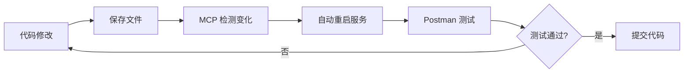

# YL-Monitor Postman API 测试集合

## 📋 概述

本文档描述了 YL-Monitor 系统的 Postman API 测试集合，以及与 VS Code MCP Server 的联动方案。

## 🎯 联动架构

```
┌─────────────────────────────────────────────────────────────┐
│                      VS Code 环境                              │
│  ┌─────────────────┐    ┌─────────────────┐    ┌──────────┐  │
│  │  YL-Monitor     │◄──►│   MCP Server    │◄──►│ Postman  │  │
│  │  VS Code 扩展   │    │  (mcp-server.js)│    │  集合    │  │
│  │                 │    │                 │    │          │  │
│  │ • 调试适配器     │    │ • 文件访问      │    │ • API测试 │  │
│  │ • 命令面板       │    │ • 代码搜索      │    │ • 自动化  │  │
│  │ • 状态监控       │    │ • 脚本执行      │    │ • 报告    │  │
│  └─────────────────┘    └─────────────────┘    └──────────┘  │
│           │                      │                    │       │
│           ▼                      ▼                    ▼       │
│  ┌─────────────────────────────────────────────────────────┐  │
│  │              YL-Monitor FastAPI 后端 (端口 5500)          │  │
│  │  • /api/health    - 健康检查                              │  │
│  │  • /api/v1/ar/*   - AR 渲染模块                          │  │
│  │  • /api/v1/dag/*  - DAG 工作流模块                        │  │
│  │  • /api/v1/scripts/* - 脚本管理                         │  │
│  │  • /api/v1/dashboard/* - 仪表板数据                       │  │
│  └─────────────────────────────────────────────────────────┘  │
└─────────────────────────────────────────────────────────────┘
```

## 🚀 快速开始

### 1. 安装 Postman

- 下载并安装 [Postman](https://www.postman.com/downloads/)
- 或使用 VS Code 的 Postman 扩展

### 2. 导入集合

**方式一：通过 VS Code 命令**
```bash
# 在 VS Code 中执行
Ctrl+Shift+P → YL-Monitor: 在 Postman 中打开集合
```

**方式二：手动导入**
1. 打开 Postman
2. 点击 `Import` → `File`
3. 选择 `tests/postman/yl-monitor-collection.json`

### 3. 配置环境

1. 在 Postman 中点击右上角的环境下拉框
2. 选择 `Import` → 导入 `tests/postman/environments/local.json`
3. 激活 `YL-Monitor Local` 环境

### 4. 启动服务

```bash
# 使用 VS Code 命令
Ctrl+Shift+P → YL-Monitor: 启动

# 或使用脚本
bash scripts/tools/start_and_verify.sh
```

## 🔧 MCP Server 功能

### 核心功能

| 功能 | 命令 | 说明 |
|------|------|------|
| 列出文件 | `list_files` | 列出项目目录结构 |
| 读取文件 | `read_file` | 读取代码文件内容 |
| 搜索代码 | `search` | 在项目中搜索代码 |
| 文件统计 | `get_file_stats` | 获取文件元数据 |
| 执行命令 | `run_shell_command` | 执行 shell 命令 |
| 文件监控 | `watch_file_changes` | 监控文件变化 |
| API 请求 | `api_request` | 直接调用 API |
| 运行脚本 | `run_monitor_script` | 执行监控脚本 |
| API 集合 | `get_api_collection` | 获取 Postman 集合信息 |

### 使用示例

**在 VS Code 中与 MCP 交互：**

```javascript
// 列出项目文件
{
  "command": "list_files",
  "args": {
    "path": "app/routes",
    "recursive": true
  }
}

// 读取文件内容
{
  "command": "read_file",
  "args": {
    "path": "app/main.py"
  }
}

// 搜索代码
{
  "command": "search",
  "args": {
    "pattern": "def.*health",
    "path": "app",
    "filePattern": "*.py"
  }
}

// 调用 API（与 Postman 联动）
{
  "command": "api_request",
  "args": {
    "method": "GET",
    "endpoint": "/api/health"
  }
}

// 执行监控脚本
{
  "command": "run_monitor_script",
  "args": {
    "script": "01_cpu_usage_monitor.py"
  }
}

// 获取 API 集合信息
{
  "command": "get_api_collection",
  "args": {
    "collection": "yl-monitor-collection"
  }
}
```

## 📡 API 端点列表

### 系统健康
- `GET /api/health` - 健康检查
- `GET /api/info` - 系统信息

### AR 模块
- `GET /api/v1/ar/status` - AR 状态
- `POST /api/v1/ar/trigger` - 触发 AR 任务
- `GET /api/v1/ar/nodes` - AR 节点列表

### DAG 模块
- `GET /api/v1/dag/status` - DAG 状态
- `POST /api/v1/dag/execute` - 执行 DAG
- `GET /api/v1/dag/list` - DAG 列表

### 脚本管理
- `GET /api/v1/scripts/status` - 脚本状态
- `POST /api/v1/scripts/execute` - 执行脚本
- `GET /api/v1/scripts/list` - 脚本列表

### 仪表板
- `GET /api/v1/dashboard/metrics` - 仪表板指标
- `GET /api/v1/dashboard/resources` - 系统资源

### WebSocket
- `GET /api/v1/ws/info` - WebSocket 信息

## 🔗 与 VS Code 扩展集成

### 命令面板

在 VS Code 中按 `Ctrl+Shift+P`，输入以下命令：

| 命令 | 功能 |
|------|------|
| `YL-Monitor: 启动` | 启动 YL-Monitor 服务 |
| `YL-Monitor: 停止` | 停止 YL-Monitor 服务 |
| `YL-Monitor: 运行 API 测试` | 执行 API 功能测试 |
| `YL-Monitor: 在 Postman 中打开集合` | 打开 Postman 并导入集合 |

### 调试配置

`.vscode/launch.json` 示例：

```json
{
  "version": "0.2.0",
  "configurations": [
    {
      "type": "yl-monitor",
      "request": "launch",
      "name": "启动 YL-Monitor + Postman 测试",
      "program": "${workspaceFolder}",
      "port": 5500,
      "browser": "firefox",
      "postman": {
        "enabled": true,
        "collection": "yl-monitor-collection",
        "environment": "local",
        "autoRun": true
      }
    }
  ]
}
```

## 🧪 自动化测试

### 使用 Newman 运行测试

```bash
# 安装 Newman
npm install -g newman newman-reporter-html

# 运行测试
newman run tests/postman/yl-monitor-collection.json \
  -e tests/postman/environments/local.json \
  --reporters cli,html \
  --reporter-html-export tests/postman/reports/report.html
```

### 集成到 CI/CD

```yaml
# .github/workflows/api-test.yml
name: API Tests

on: [push, pull_request]

jobs:
  test:
    runs-on: ubuntu-latest
    steps:
      - uses: actions/checkout@v2
      
      - name: Start YL-Monitor
        run: bash scripts/tools/start_and_verify.sh
      
      - name: Run API Tests
        run: |
          npm install -g newman
          newman run tests/postman/yl-monitor-collection.json \
            -e tests/postman/environments/local.json
      
      - name: Upload Results
        uses: actions/upload-artifact@v2
        with:
          name: test-results
          path: tests/postman/reports/
```

## 📝 最佳实践

### 1. 开发工作流



### 2. API 测试策略

- **单元测试**: 单个 API 端点测试
- **集成测试**: 多步骤工作流测试
- **性能测试**: 并发请求测试
- **监控测试**: 定期健康检查

### 3. 安全注意事项

- 不要在集合中存储敏感信息
- 使用环境变量管理认证令牌
- 定期更新测试数据
- 限制生产环境的测试频率

## 🔍 故障排除

### 常见问题

**Q: Postman 无法连接到服务？**
```bash
# 检查服务状态
curl http://localhost:5500/api/health

# 检查端口占用
lsof -i :5500
```

**Q: MCP Server 无法启动？**
```bash
# 检查 Node.js 版本
node --version  # 需要 v14+

# 手动启动 MCP Server
node .vscode/mcp-server.js $(pwd)
```

**Q: 集合导入失败？**
- 检查 JSON 格式
- 验证 Postman 版本（建议 v10+）
- 尝试手动创建集合

## 📚 相关文档

- [VS Code MCP 文档](https://code.visualstudio.com/api/extension-guides/chat)
- [Postman API 文档](https://learning.postman.com/docs/)
- [Newman 文档](https://learning.postman.com/docs/collections/using-newman-cli/)
- [YL-Monitor 项目文档](../README.md)

## 🤝 贡献

欢迎提交 Issue 和 PR 来改进测试集合！

## 📄 许可证

MIT License - 详见项目根目录 LICENSE 文件
